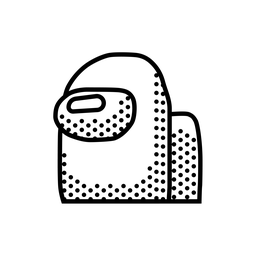

# Awesome Project Template

> Based on the React-Native Awesome Project template with some addons that will help to streamline a project initiation

## Installing / Getting started

Copy the code using your `git` desktop application or by:

```shell
gh repo clone wiezmankimchi/basic-rn-project
cd basic-rn-project
npm install
cd ios
pod install
```

- We clone the project to the `basic-rn-project` folder
- Installing all dependencies in the project root folder
- Installing iOS specific `cocoapods` dependencies

### What add-ons are includes

The project includes the following:

- React-Native [_Link_](https://reactnative.dev/)
- React Navigation [_Link_](https://reactnavigation.org/)
- NativeBase [_Link_](https://nativebase.io/)
- React Native Vector Icons [_Link_](https://github.com/oblador/react-native-vector-icons)`/`[_Icons Directory_](https://oblador.github.io/react-native-vector-icons/)

## Basic Structure

The project includes:

1. Home Screen
2. Navigation to 'Details' screen
3. Home Icon Navigation

## Links

Even though this information can be found inside the project on machine-readable
format like in a .json file, it's good to include a summary of most useful
links to humans using your project. You can include links like:

- Project homepage: https://github.com/wiezmankimchi/AwesomeProject
- Issue tracker: https://github.com/wiezmankimchi/AwesomeProject/issues

## MIT License

Permission is hereby granted, free of charge, to any person obtaining a copy of this software and associated documentation files (the "Software"), to deal in the Software without restriction, including without limitation the rights to use, copy, modify, merge, publish, distribute, sublicense, and/or sell copies of the Software, and to permit persons to whom the Software is furnished to do so, subject to the following conditions:

The above copyright notice and this permission notice shall be included in all copies or substantial portions of the Software.

THE SOFTWARE IS PROVIDED "AS IS", WITHOUT WARRANTY OF ANY KIND, EXPRESS OR IMPLIED, INCLUDING BUT NOT LIMITED TO THE WARRANTIES OF MERCHANTABILITY, FITNESS FOR A PARTICULAR PURPOSE AND NONINFRINGEMENT. IN NO EVENT SHALL THE AUTHORS OR COPYRIGHT HOLDERS BE LIABLE FOR ANY CLAIM, DAMAGES OR OTHER LIABILITY, WHETHER IN AN ACTION OF CONTRACT, TORT OR OTHERWISE, ARISING FROM, OUT OF OR IN CONNECTION WITH THE SOFTWARE OR THE USE OR OTHER DEALINGS IN THE SOFTWARE.
